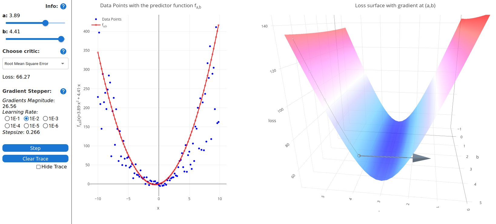

# 3D Gradient Descent WebApp

This app tries to visualize gradient descent of a loss function with two parameters, resulting in a loss surface in $3$-dimensional space.

It uses the following technologies:
* [react](https://reactjs.org/) for state management,
* [mui](https://mui.com/) for UI components,
* [react-plotly](https://plotly.com/javascript/react/) for 2D and 3D plotting,
* [react-katex](https://www.npmjs.com/package/react-katex) for TeX support,
* [d3](https://d3js.org/) for data generation,
* [gh-pages](https://github.com/gitname/react-gh-pages) to deploy to Github pages.

If you want to run the app locally you can clone this repo and run `npm install` from the root folder to install all dependancies; `npm start` starts the app.

_The idea to build this as came from the Fast.ai [forums](https://forums.fast.ai), in particular: I took much inspiration from Christian Wittmann's great [threat](https://forums.fast.ai/t/visualizing-gradient-descent-in-3d/101084) on the toppic, you should check it out if you are interested in the computations that are happening to generate such plots._